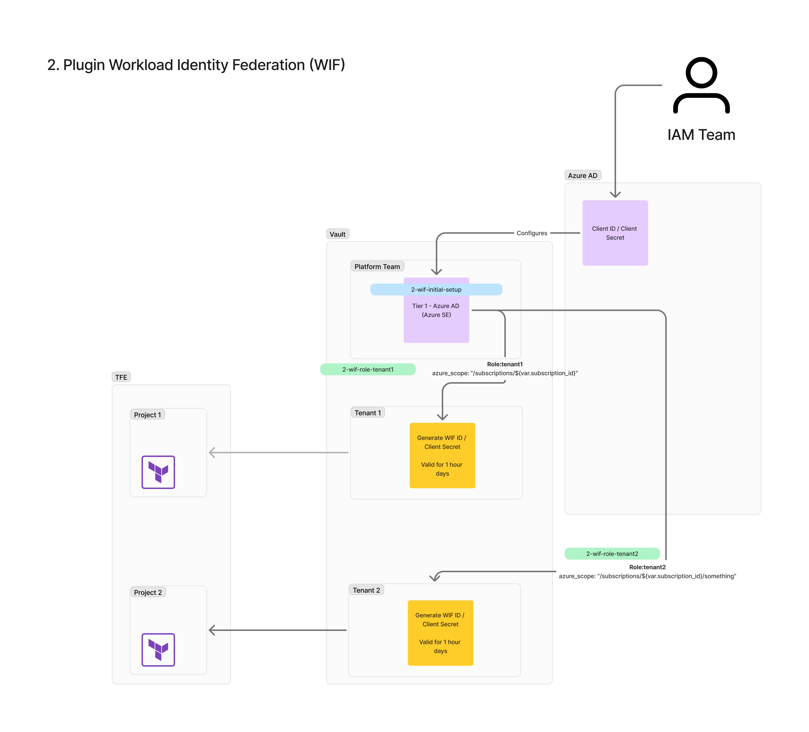

# Vault Azure AD Kubernetes Example

This repository demonstrates how to use HashiCorp Vault Enterprise to enable self-service provisioning of Azure Kubernetes (K8s) resources. We will walk through the setup of Vault, dynamic credential generation using Azure AD, and the use of Terraform modules to manage these configurations.

If you want to run this all at once then jump just to [# 3. Using TF to create orignal creds - all in one](#3-using-tf-to-create-orignal-creds---all-in-one)

## Prerequisites

Before proceeding, ensure you have the following:

- [Vault CLI installed](https://developer.hashicorp.com/vault/docs/install)
- A local Kubernetes (K8s) cluster
- An Azure account with necessary permissions
- A Vault Enterprise license

# Setting Up Azure Credentials

We'll use an Azure Application's `client_id` and `client_secret` for all the following configurations. This guide will show you how to use Terraform (TF) to set this up.

## Authenticate to Azure

Before running the Terraform configuration, we need to authenticate to Azure. Follow these steps:

1. Log in to Azure:

```bash
az login
```

2. Once logged in, set your subscription ID:

```bash 
export TF_VAR_subscription_id="<SUBSCRIPTION_ID>"
```

## Running Terraform

Now, navigate to the setup directory and run the following commands to initialize and apply the Terraform configuration:

```bash
cd 0-azure-setup
terraform init
terraform apply
```

## Set the Required Environment Variables

After running the Terraform configuration, you can set the environment variables based on the outputs. 

**NOTE:** To get the `client_secret`, run `terraform output client_secret`.

```bash
export TF_VAR_tenant_id=""
export TF_VAR_client_id=""
export TF_VAR_client_secret=""
export TF_VAR_subscription_id=""
```

Alternatively, use the following command to set these variables automatically:

```bash
source ../set-azure-creds.sh
```

---

## Starting Vault

We will use a local Kubernetes cluster with Vault Enterprise deployed via Helm.

### Step 1: Prepare the Vault License

Before deploying Vault, you need to create a Kubernetes secret containing your Vault Enterprise license. Replace `vault.hclic` with the actual path to your license file.

Alternatively, you can copy the `vault.hclic` file into this directory (the `.gitignore` file already prevents this from being committed).

### Step 2: Deploy Vault

Run the `install-vault.sh` script to install and initialize Vault:

```bash
source install-vault.sh
```

This script will set up Vault and configure it for this example.

### Step 3: Accessing Vault

To access Vault locally, set up port forwarding in the background with the following command:

```bash
kubectl -n vault port-forward services/vault 8200:8200 2>&1 >/dev/null & PORT_FORWARD_PID=$!; echo $PORT_FORWARD_PID > pid
```

This forwards port `8200` from Vault to your local machine and stores the process ID in a file named `pid`. Alternatively, you can run:

```bash
kubectl -n vault port-forward services/vault 8200:8200
```

This will occupy your terminal until manually stopped.

### Stopping the Port Forwarding

If you used the background method, stop the process by running:

```bash
kill $(cat pid)
```

This frees up port `8200` on your local machine.

You can use Vault’s root token (output at the end of the setup script) to log in. Alternatively, check the `init.json` file for the root token.

## Cleanup Vault

To remove all Vault components and related Kubernetes resources, run:

```bash
kubectl delete ns vault
```

---

# 0. Basic Setup

The initial setup creates foundational components for the Vault platform team. Aside from the namespace creation, the rest of the setup is an example of how modules can be structured. We use Vault's root token for simplicity in this example.

### Components Created:
- **Vault Platform Team Namespace**: A dedicated namespace for the platform team.
- **Full Control Policy**: A policy granting full control over the platform team namespace.
- **Userpass Authentication**: A basic user-password authentication method.
- **JWT Authentication**: For external service integration.

### Prerequisites:

Make sure the Vault root token is set as the `TF_VAR_vault_token` environment variable. If you ran the previous Vault setup script with `source`, this variable should already be set. If not, run the following command with your root token:

```bash
export TF_VAR_vault_token="s.xxxxxxx"
```

### Steps to Build the Initial Vault Configuration:

1. Navigate to the setup directory:

```bash
cd 0-platform-team-initial-setup
terraform init
terraform apply
```

This creates the platform team namespace and additional components in Vault.

# 1. Dynamic Credentials
This section covers dynamic credential generation using the parent namespace Azure Secret Engine to configure the Tenant Azure Secret Engine.


### Pros
- Easy to set up using Terraform.

### Cons
- Terraform must be rerun every 30 days to refresh credentials.
- Long-lived credentials need rotation.
- Can't run this all at once. The problem I found is that it takes up to an hour for the credentials to work when rotated!

### Notes
- If the platform team root is rotated, the tenant stops working. To fix this:
    1. Run `terraform apply` on `1-dynamic-credentials-tenant1`.
    2. Wait 1 minute to 3 hours for Azure to persist the new service principal (this delay is an Azure issue, not Vault).
    3. Possible errors include:
        - `Insufficient privileges to complete the operation.` Seen this when Azure has not yet persisted the App registrations.
        - `The identity of the calling application could not be established.` Seen when the App registration is deleted.
        - `Application not found in the directory.` Seen this later after App registration is deleted.

## To Deploy

Obtain your Azure Tenant ID, Client ID, Client Secret, and Subscription ID. If you've already followed the steps in the [Setting Up Azure Credentials](#setting-up-azure-credentials) section, you can skip step one. Otherwise, refer to the [Azure Credentials Setup Guide](./azure-credentials-setup.md) for detailed instructions.


### Step 1: Deploy Azure Secret Engine for Platform Team

Set the environment variables if you have not already:

```bash
export TF_VAR_tenant_id=""
export TF_VAR_client_id=""
export TF_VAR_client_secret=""
export TF_VAR_subscription_id=""
```

Then deploy using Terraform:

```bash
cd ..
cd 1-dynamic-credentials-platform-team
terraform init
terraform apply
```

To manually test:

```bash
export VAULT_NAMESPACE="platform-team"
vault list azure/roles
vault write -f azure/rotate-root 
vault read azure/creds/platform-team
unset VAULT_NAMESPACE
```

### Step 2: Provision Tenant

Next, provision a tenant. This only requires the `TF_VAR_subscription_id` and `TF_VAR_tenant_id`. The `client_id` and `client_secret` will be generated automatically using the platform team’s Azure Secret Engine.

```bash
cd ..
cd 1-dynamic-credentials-tenant1
terraform init
terraform apply
```

To manually test (wait 10-15 minutes before running this):

```bash
export VAULT_NAMESPACE="tenant1"
vault read azure/config
vault list azure/roles
vault write -f azure/rotate-root 
vault read azure/creds/tenant1
unset VAULT_NAMESPACE
```


---

# 2. Plugin Workload Identity Federation (WIF)

In this section, we will integrate Workload Identity Federation (WIF) to enable secure, token-based authentication between HashiCorp Vault and Azure AD. WIF allows workloads running in Kubernetes or other environments to authenticate with Azure AD without needing long-lived credentials. By using short-lived tokens, this approach enhances security and scalability when accessing Azure resources. We will configure the necessary Vault plugins and demonstrate how Terraform can manage WIF setup, ensuring that your platform and tenant teams can securely access Azure resources without manual credential handling.



### Pros
- Short-lived credentials, enhancing security.

### Cons
- Requires Vault 1.17 or later.
- Added complexity:
    - `identity/oidc` needs to be configured and enabled.
    - Ensure that Vault's `openid-configuration` and public `JWKS` APIs are network-reachable by Azure.
    - Short-lived credentials enhance security but are more complex to integrate and manage frequent credential rotations effectively.
- Ensure `api_addr` is set to the external API URL.
- Would not be able to have an Azure mount in the tenants that use the `client_id` & `client_secret` generated from the `platform-team` mount as they are so short-lived. However, you can set up Azure mounts in each tenant with the same config as the platform team.
    - An alternative would be to use `group_policy_application_mode`: [Secrets management across namespaces without hierarchical relationship](https://developer.hashicorp.com/vault/tutorials/enterprise/namespaces-secrets-sharing).

### Notes
- HCP Vault is 1.15 🤦‍♂️
- `vault_identity_oidc` gets created every time!
- If you get the error `No matching federated identity record found for presented assertion audience 'https://<vault_url>:8200/v1/platform-team/identity/oidc/plugins'`, this is likely a cache issue. Wait for the cache to refresh and test again.
- If you get `No matching federated identity record found for presented assertion issuer`, then the `vault_identity_oidc` in `modules/2-vault-azure-secrets-engine/main.tf` is incorrect.

## To Deploy
For this, we need Vault deployed using HTTPS, and it must be network-reachable by Azure.

In my previous tests, using a proxy didn't work, so I switched to deploying Vault on an EC2 instance. You can find the proxy notes [here](./vault-proxy-notes.md).

1. Use the [tf-ec2-vault](./tf-ec2-vault/) repository to provision an EC2 instance.

```bash
cd tf-ec2-vault
terraform init
terraform apply
cd ..
```

2. Set up an A record on your DNS provider (e.g., Route 53) pointing to the EC2 instance, e.g., `vault.example.com`. To retrieve the IP address of the EC2 instance, run:

```bash
terraform output public_ip
```

3. SSH into the EC2 instance:

```bash
ssh ubuntu@vault.example.com
```

4. Use Certbot to obtain a Let's Encrypt SSL certificate for your domain. **Replace the domain with your own**:

```bash
sudo certbot --nginx -d vault.example.com
```

5. Vault should already be installed. Copy the license file to `/tmp/vault.hclic` (e.g., `scp vault.hclic ubuntu@vault.example.com:`).

6. Copy the `vault.hcl` configuration file to the EC2 instance (e.g., `scp jumpbox/vault.hcl ubuntu@vault.example.com:`). **Ensure you update the certificate file locations and DNS values to match your setup**.

7. Start Vault:

```bash
mkdir -p ./vault/data
sudo vault server -config=vault.hcl
```

8. Configure Vault **from your local machine**. **Amend the URL to match your domain**:

```bash
unset VAULT_TOKEN
export VAULT_ADDR="https://vault.example.com:8200"
vault operator init

vault operator unseal
vault operator unseal
vault operator unseal

export VAULT_TOKEN=hvs.******
```

Next, let's configure Vault:

```bash
export TF_VAR_vault_addr=$VAULT_ADDR
export TF_VAR_vault_token=$VAULT_TOKEN
```

If your Azure environment variables are not already set, configure them as follows:

```bash
export TF_VAR_subscription_id="<your-subscription-id>"
export TF_VAR_tenant_id="<your-tenant-id>"
export TF_VAR_client_id="<your-client-id>"
```

9. Now we can set up Vault. Run the following to set up the initial namespace, etc., in Vault:

```bash
cd 2-wif-initial-setup
terraform init
terraform apply
```

## Configuring Azure and Vault WIF

A more detailed guide can be found for Vault [here](https://developer.hashicorp.com/vault/docs/secrets/azure#plugin-workload-identity-federation-wif) and for Azure [here](https://learn.microsoft.com/en-us/entra/workload-id/workload-identity-federation-create-trust?pivots=identity-wif-apps-methods-azp#other-identity-providers).

### Configuring Azure Federated Credentials

1. Find your Azure App Registration, likely named `Vault Platform Team`, in the Azure portal. Navigate to **Certificates & Secrets** > **Federated Credentials** and select **Add Credential**.

2. Set the following values, replacing the URL with your Vault URL. Update the Subject Identifier to match your setup, e.g., `plugin-identity:<NAMESPACE>:secret:<AZURE_MOUNT_ACCESSOR>`. **Note:** You can use the `azure_subject_identifier` output from `2-wif-initial-setup`.

| Field              | Value                                                   |
|--------------------|---------------------------------------------------------|
| Issuer             | `https://<vault_url>:8200/v1/platform-team/identity/oidc/plugins` |
| Subject identifier | `plugin-identity:<NAMESPACE>:secret:<AZURE_MOUNT_ACCESSOR>` |
| Name               | `Vault`                                                 |
| Audience           |  `<vault_url>:8200/v1/platform-team/identity/oidc/plugins` |


### Setting Up the Azure Secrets Engine Role

1. Set up the Azure Secrets Engine Role in the platform team account. Make sure the necessary environment variables (`TF_VAR_client_id`, `TF_VAR_tenant_id`, and `TF_VAR_subscription_id`) are set. If not, go back to [Step 1: Deploy Azure Secret Engine for Platform Team](#step-1-deploy-azure-secret-engine-for-platform-team).

```bash
cd 2-wif-role-tenant1
terraform init
terraform apply
```

2. Repeat this process for other tenant roles as needed.

### Testing the Setup

1. To test the setup with Vault, you can use the following commands:

```bash
export VAULT_NAMESPACE="platform-team"
vault read azure/config
vault list azure/roles
vault read azure/creds/tenant1
vault read azure/creds/tenant2
unset VAULT_NAMESPACE
```

2. To test in Azure, use the following command, replacing `<CLIENT_ID>` and `<CLIENT_SECRET>` with the values outputted from Terraform. The `TF_VAR_tenant_id` should already be set.

```bash
az login --service-principal -u <CLIENT_ID> -p <CLIENT_SECRET> --tenant $TF_VAR_tenant_id
az group list --output table
```

In my testing, I had groups `azure-vault-group` and `testing-23`. Here’s the result confirming the scope works:

| Name     | Assigned Scope                                                           | Groups Visible                    |
|----------|--------------------------------------------------------------------------|-----------------------------------|
| tenant1  | `/subscriptions/${var.subscription_id}`                                  | azure-vault-group, testing-23     |
| tenant2  | `/subscriptions/${var.subscription_id}/resourceGroups/azure-vault-group` | azure-vault-group                 |

**NOTE:** You can test the configuration by visiting `https://<vault_url>:8200/v1/platform-team/identity/oidc/plugins/.well-known/openid-configuration`.

## Choosing Between Dynamic or Existing Service Principals

Dynamic service principals are preferred if Azure resources can be provided via the RBAC system and roles defined in the Vault role. This type of credential is decoupled from other clients, offers better audit granularity, and is not affected by permission changes after issuance.

However, some Azure services may require an existing service principal. This service principal will have the necessary access, and Vault can generate new passwords for it. Any changes to its permissions will affect all clients. Azure also limits the number of passwords for a service principal based on object size, which can lead to errors if exceeded. This can be managed by reducing the role TTL or creating another Vault role for a different service principal with similar permissions.

## 3. Using Terraform to Create Original Credentials - All in One

Before proceeding, ensure you have a running Vault instance. You can follow steps 1 to 8 from [this guide](#to-deploy-1).

### Prerequisites:
- **Azure CLI** installed
- **Terraform** installed
- **Vault** running
- An Azure account with necessary permissions
- A Vault Enterprise license

### Steps:

1. **Log in to Azure:**

Ensure you are authenticated with the correct Azure subscription:
   
```bash
az login
```

2. **Set Environment Variables:**

Export the required environment variables to set your Terraform variables:
   
```bash
export TF_VAR_subscription_id="<SUBSCRIPTION_ID>"
export VAULT_ADDR="https://vault.example.com:8200"
export VAULT_TOKEN="hvs.******"
export TF_VAR_vault_addr="$VAULT_ADDR"
export TF_VAR_vault_token="$VAULT_TOKEN"
```

**Note:** Replace `<SUBSCRIPTION_ID>` and `hvs.******` with your actual subscription ID and Vault token.

3. **Run Terraform to Set Up Azure App and Vault Configuration:**
```bash
unset VAULT_NAMESPACE
cd 3-all-in-one-platform-team
terraform init
terraform apply
```

**Note:** Review the output to ensure that everything is set up correctly.

4. **Test the Configuration:**

Once the Terraform setup is complete, you can verify the configuration by interacting with the Vault instance:

Set the namespace to match your setup:

```bash
export VAULT_NAMESPACE="vault-platform-all-in-one"
vault read azure/config
vault list azure/roles
vault read azure/creds/tenant1
vault read azure/creds/tenant2
unset VAULT_NAMESPACE
```

Testing the azure creds

```bash
az login --service-principal -u <CLIENT_ID> -p <CLIENT_SECRET> --tenant $TF_VAR_tenant_id
az group list --output table
```