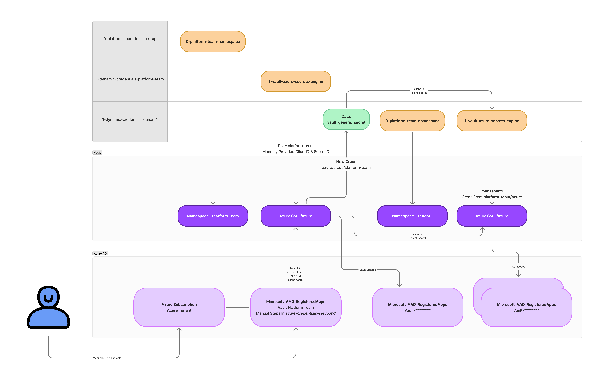

# Vault Azure AD Kubernetes Example

This repository demonstrates how to use HashiCorp Vault Enterprise to enable self-service provisioning of Azure Kubernetes (K8s) resources. We will walk through the setup of Vault, dynamic credential generation using Azure AD, and the use of Terraform modules to manage these configurations.


## Prerequisites

Before proceeding, ensure you have the following:

- [Vault CLI installed](https://developer.hashicorp.com/vault/docs/install)
- A local Kubernetes (K8s) cluster
- An Azure account with necessary permissions
- A Vault Enterprise license

## Starting Vault

We will use a local Kubernetes cluster with Vault Enterprise deployed via Helm.

### Step 1: Prepare the Vault License

Before deploying Vault, you need to create a Kubernetes secret containing your Vault Enterprise license. Replace `vault.hclic` with the actual path to your license file.

Alternatively, you can copy the `vault.hclic` file into this directory (the `.gitignore` file already prevents this from being committed).

### Step 2: Deploy Vault

Run the `install-vault.sh` script to install and initialize Vault:

```bash
source install-vault.sh
```

This script will set up Vault and configure it for this example.

### Step 3: Accessing Vault

To access Vault locally, set up port forwarding in the background with the following command:

```bash
kubectl -n vault port-forward services/vault 8200:8200 2>&1 >/dev/null & PORT_FORWARD_PID=$!; echo $PORT_FORWARD_PID > pid
```

This forwards port `8200` from Vault to your local machine and stores the process ID in a file named `pid`. Alternatively, you can run:

```bash
kubectl -n vault port-forward services/vault 8200:8200
```

This will occupy your terminal until manually stopped.

### Stopping the Port Forwarding

If you used the background method, stop the process by running:

```bash
kill $(cat pid)
```

This frees up port `8200` on your local machine.

You can use Vault’s root token (output at the end of the setup script) to log in. Alternatively, check the `init.json` file for the root token.

## Cleanup Vault

To remove all Vault components and related Kubernetes resources, run:

```bash
kubectl delete ns vault
```

---

# 0. Basic Setup

The initial setup creates foundational components for the Vault platform team. Aside from the namespace creation, the rest of the setup is an example of how modules can be structured. We use Vault's root token for simplicity in this example.

### Components Created:
- **Vault Platform Team Namespace**: A dedicated namespace for the platform team.
- **Full Control Policy**: A policy granting full control over the platform team namespace.
- **Userpass Authentication**: A basic user-password authentication method.
- **JWT Authentication**: For external service integration.

### Prerequisites:

Make sure the Vault root token is set as the `TF_VAR_vault_token` environment variable. If you ran the previous Vault setup script with `source`, this variable should already be set. If not, run the following command with your root token:

```bash
export TF_VAR_vault_token="s.xxxxxxx"
```

### Steps to Build the Initial Vault Configuration:

1. Navigate to the setup directory:

```bash
cd 0-platform-team-initial-setup
terraform init
terraform apply
```

This creates the platform team namespace and additional components in Vault.

# 1. Dynamic Credentials

This section covers dynamic credential generation using the parent namespace Azure Secret Engine to configure the Tenant Azure Secret Engine.



### Pros
- Easy to set up using Terraform.

### Cons
- Terraform must be rerun every 30 days to refresh credentials.
- Long-lived credentials need rotation.

### Notes
- If the platform team root is rotated, the tenant stops working. To fix this:
    1. Run `terraform apply` on `1-dynamic-credentials-tenant1`.
    2. Wait 1 minute to 3 hours for Azure to persist the new service principal (this delay is an Azure issue, not Vault).
    3. Possible errors include:
        - `Insufficient privileges to complete the operation.` Seen this when Azure has not yet persisited the App registrations
        - `The identity of the calling application could not be established.` Seen that the App registration is deleted when seeing this message
        - `Application not found in the directory.` Seen this later after App registration is deleted when seeing this message
    4. testing
        - 9:40pm created client_id `cbc17df7-7c4f-47e9-abcc-5525f5252eab` manualy
        - 9:51pm run tf apply on `1-dynamic-credentials-tenant1` to make tenant using that client_id\
        - 9:53pm tested `vault read azure/creds/tenant1` got `The identity of the calling application could not be established.`, will test tommorow

## To Deploy

Obtain your Azure Tenant ID, Client ID, Client Secret, and Subscription ID by following the steps in the [Azure Credentials Setup Guide](./azure-credentials-setup.md).

### Step 1: Deploy Azure Secret Engine for Platform Team

Set the environment variables:

```bash
export TF_VAR_tenant_id=""
export TF_VAR_client_id=""
export TF_VAR_client_secret=""
export TF_VAR_subscription_id=""
```

Then deploy using Terraform:

```bash
cd ..
cd 1-dynamic-credentials-platform-team
terraform init
terraform apply
```

To manually test:

```bash
export VAULT_NAMESPACE="platform-team"
vault list azure/roles
vault write -f azure/rotate-root 
vault read azure/creds/platform-team
unset VAULT_NAMESPACE
```

### Step 2: Provision Tenant

Next, provision a tenant. This only requires the `TF_VAR_subscription_id` and `TF_VAR_tenant_id`. The `client_id` and `client_secret` will be generated automatically using the platform team’s Azure Secret Engine.

```bash
cd ..
cd 1-dynamic-credentials-tenant1
terraform init
terraform apply
```

To manually test (wait 10-15 minutes before running this):

```bash
export VAULT_NAMESPACE="tenant1"
vault read azure/config
vault list azure/roles
vault write -f azure/rotate-root 
vault read azure/creds/tenant1
unset VAULT_NAMESPACE
```

---

# 2. Plugin Workload Identity Federation (WIF)

In this section, we will integrate Workload Identity Federation (WIF) to enable secure, token-based authentication between HashiCorp Vault and Azure AD. WIF allows workloads running in Kubernetes or other environments to authenticate with Azure AD without needing long-lived credentials. By using short-lived tokens, this approach enhances security and scalability when accessing Azure resources. We will configure the necessary Vault plugins and demonstrate how Terraform can manage WIF setup, ensuring that your platform and tenant teams can securely access Azure resources without manual credential handling.

### Pros
- Short-lived credentials, enhancing security.

### Cons
- Requires Vault 1.17 or later.
