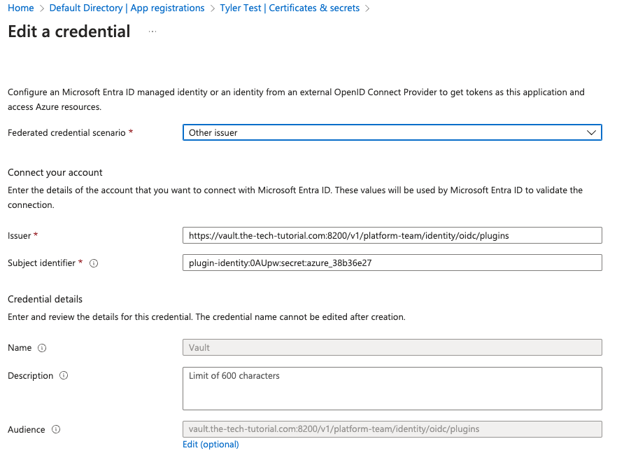

# Vault Azure AD Kubernetes Example

This repository demonstrates how to use HashiCorp Vault Enterprise to enable self-service provisioning of Azure Kubernetes (K8s) resources. We will walk through the setup of Vault, dynamic credential generation using Azure AD, and the use of Terraform modules to manage these configurations.


## Prerequisites

Before proceeding, ensure you have the following:

- [Vault CLI installed](https://developer.hashicorp.com/vault/docs/install)
- A local Kubernetes (K8s) cluster
- An Azure account with necessary permissions
- A Vault Enterprise license

## Starting Vault

We will use a local Kubernetes cluster with Vault Enterprise deployed via Helm.

### Step 1: Prepare the Vault License

Before deploying Vault, you need to create a Kubernetes secret containing your Vault Enterprise license. Replace `vault.hclic` with the actual path to your license file.

Alternatively, you can copy the `vault.hclic` file into this directory (the `.gitignore` file already prevents this from being committed).

### Step 2: Deploy Vault

Run the `install-vault.sh` script to install and initialize Vault:

```bash
source install-vault.sh
```

This script will set up Vault and configure it for this example.

### Step 3: Accessing Vault

To access Vault locally, set up port forwarding in the background with the following command:

```bash
kubectl -n vault port-forward services/vault 8200:8200 2>&1 >/dev/null & PORT_FORWARD_PID=$!; echo $PORT_FORWARD_PID > pid
```

This forwards port `8200` from Vault to your local machine and stores the process ID in a file named `pid`. Alternatively, you can run:

```bash
kubectl -n vault port-forward services/vault 8200:8200
```

This will occupy your terminal until manually stopped.

### Stopping the Port Forwarding

If you used the background method, stop the process by running:

```bash
kill $(cat pid)
```

This frees up port `8200` on your local machine.

You can use Vault’s root token (output at the end of the setup script) to log in. Alternatively, check the `init.json` file for the root token.

## Cleanup Vault

To remove all Vault components and related Kubernetes resources, run:

```bash
kubectl delete ns vault
```

---

# 0. Basic Setup

The initial setup creates foundational components for the Vault platform team. Aside from the namespace creation, the rest of the setup is an example of how modules can be structured. We use Vault's root token for simplicity in this example.

### Components Created:
- **Vault Platform Team Namespace**: A dedicated namespace for the platform team.
- **Full Control Policy**: A policy granting full control over the platform team namespace.
- **Userpass Authentication**: A basic user-password authentication method.
- **JWT Authentication**: For external service integration.

### Prerequisites:

Make sure the Vault root token is set as the `TF_VAR_vault_token` environment variable. If you ran the previous Vault setup script with `source`, this variable should already be set. If not, run the following command with your root token:

```bash
export TF_VAR_vault_token="s.xxxxxxx"
```

### Steps to Build the Initial Vault Configuration:

1. Navigate to the setup directory:

```bash
cd 0-platform-team-initial-setup
terraform init
terraform apply
```

This creates the platform team namespace and additional components in Vault.

# 1. Dynamic Credentials

This section covers dynamic credential generation using the parent namespace Azure Secret Engine to configure the Tenant Azure Secret Engine.


### Pros
- Easy to set up using Terraform.

### Cons
- Terraform must be rerun every 30 days to refresh credentials.
- Long-lived credentials need rotation.
- Cant run this all at once, the problem I found is that it takes up to an hour for the creds to work when rotated!

### Notes
- If the platform team root is rotated, the tenant stops working. To fix this:
    1. Run `terraform apply` on `1-dynamic-credentials-tenant1`.
    2. Wait 1 minute to 3 hours for Azure to persist the new service principal (this delay is an Azure issue, not Vault).
    3. Possible errors include:
        - `Insufficient privileges to complete the operation.` Seen this when Azure has not yet persisited the App registrations
        - `The identity of the calling application could not be established.` Seen that the App registration is deleted when seeing this message
        - `Application not found in the directory.` Seen this later after App registration is deleted when seeing this message
    4. testing
        - 9:40pm created client_id `cbc17df7-7c4f-47e9-abcc-5525f5252eab` manualy
        - 9:51pm run tf apply on `1-dynamic-credentials-tenant1` to make tenant using that client_id\
        - 9:53pm tested `vault read azure/creds/tenant1` got `The identity of the calling application could not be established.`, will test tommorow
        - Still running into the `was not found in the directory 'Default Directory'` I feel like this is a permision issue as I'm trying to grant owner but not sure at this stage. 

## To Deploy

Obtain your Azure Tenant ID, Client ID, Client Secret, and Subscription ID by following the steps in the [Azure Credentials Setup Guide](./azure-credentials-setup.md).

### Step 1: Deploy Azure Secret Engine for Platform Team

Set the environment variables:

```bash
export TF_VAR_tenant_id=""
export TF_VAR_client_id=""
export TF_VAR_client_secret=""
export TF_VAR_subscription_id=""
```

Then deploy using Terraform:

```bash
cd ..
cd 1-dynamic-credentials-platform-team
terraform init
terraform apply
```

To manually test:

```bash
export VAULT_NAMESPACE="platform-team"
vault list azure/roles
vault write -f azure/rotate-root 
vault read azure/creds/platform-team
unset VAULT_NAMESPACE
```

### Step 2: Provision Tenant

Next, provision a tenant. This only requires the `TF_VAR_subscription_id` and `TF_VAR_tenant_id`. The `client_id` and `client_secret` will be generated automatically using the platform team’s Azure Secret Engine.

```bash
cd ..
cd 1-dynamic-credentials-tenant1
terraform init
terraform apply
```

To manually test (wait 10-15 minutes before running this):

```bash
export VAULT_NAMESPACE="tenant1"
vault read azure/config
vault list azure/roles
vault write -f azure/rotate-root 
vault read azure/creds/tenant1
unset VAULT_NAMESPACE
```

---

# 2. Plugin Workload Identity Federation (WIF)

In this section, we will integrate Workload Identity Federation (WIF) to enable secure, token-based authentication between HashiCorp Vault and Azure AD. WIF allows workloads running in Kubernetes or other environments to authenticate with Azure AD without needing long-lived credentials. By using short-lived tokens, this approach enhances security and scalability when accessing Azure resources. We will configure the necessary Vault plugins and demonstrate how Terraform can manage WIF setup, ensuring that your platform and tenant teams can securely access Azure resources without manual credential handling.

### Pros
- Short-lived credentials, enhancing security.

### Cons
- Requires Vault 1.17 or later.
- Added complexity
    - identity/oidc needs to be configured and enabled
    - Need to ensure that Vault openid-configuration and public JWKS APIs are network-reachable by Azure

### Notes
- HCP Vault is 1.15 🤦‍♂️
- Getting `No matching federated identity record found for presented assertion issuer 'https://vault.the-tech-tutorial.com:8220/v1/platform-team/identity/oidc/plugins'.` error
- Getting `No matching federated identity record found for presented assertion audience 'http://127.0.0.1:8200/v1/identity/oidc'.`
    - This is probably as the server is hosted on http://127.0.0.1:8200 but once setup correclty its the audience that is now wrong
    - Found it and fixed it
- Getting `No matching federated identity record found for presented assertion audience 'https://vault.the-tech-tutorial.com:8220/v1/platform-team/identity/oidc/plugins'`
- Deleted Vault and started again
- Getting `No matching federated identity record found for presented assertion issuer 'http://10.1.8.46:8200/v1/platform-team/identity/oidc/plugins'`
    - No Idea why this changed
    - `10.1.8.46` is the pod IP
- Feeling like my SSH hack will not help us and this needs to be legit

## To Deploy
For this we need Vault deployed using https and it needs to be network-reachable by Azure.

For my testing magic:

* Use [quick-ec2-tf](https://github.com/tallen-hashicorp/quick-ec2-tf) to setup a ec2 instance
* Setup a A record on my personal route 53 `vault.the-tech-tutorial.com`
* Install Nginx and Certbot
```bash
sudo apt update
sudo apt install nginx certbot python3-certbot-nginx
```
* copy [default-pre](./jumpbox/default-pre) to /etc/nginx/sites-enabled/default
* Use certbot to obtain a Let’s Encrypt SSL certificate **change the domain** `sudo certbot --nginx -d vault.the-tech-tutorial.com`
* Replace `vault.the-tech-tutorial.com` with the public dns of the box `line3` **&** `line25` in [default](./jumpbox/default)
* Also update the cert file locations to whatever certbot made
* Copy [default](./jumpbox/default) to the server `/etc/nginx/sites-enabled/default`
* run `ssh -R 0.0.0.0:8200:127.0.0.1:8200 ubuntu@34.198.16.120` opening a tunnel
* hit https://vault.the-tech-tutorial.com:8220/
* Woop local vault with vault https, I of course do not recomend this insanity in production. 

If we are starting here you need to set the relevent env vars:

```bash
export TF_VAR_vault_addr="http://127.0.0.1:8200"
export TF_VAR_subscription_id=""
export TF_VAR_tenant_id=""
export TF_VAR_client_id=""
export TF_VAR_client_secret=""
```


1. Now we can setup Vault, run the following the setup the inital namespace etc in Vault

```bash
cd 2-wif-initial-setup
terraform init
terraform apply
```


Now we need to configure Azure, a more detailed guide can be found for Vault [here](https://developer.hashicorp.com/vault/docs/secrets/azure#plugin-workload-identity-federation-wif) and Azure [here](https://learn.microsoft.com/en-us/entra/workload-id/workload-identity-federation-create-trust?pivots=identity-wif-apps-methods-azp#other-identity-providers):

2. Find your app registration you created ealier, probably called `Vault Platform Team` in the app registrations experience of the Microsoft Entra admin center. Select Certificates & secrets in the left nav pane, select the Federated credentials tab, and select Add credential.

3. Set the following values, replacing the URL with your vault URL

| Field              | Value                                               |
|--------------------|-----------------------------------------------------|
| Issuer             | `https://{VAULT_URL}:8200/v1/platform-team/identity/oidc/plugins` |
| Subject identifier | `plugin-identity:platform-team:secret:azure`              |
| Name               | `Vault`                                                   |



4. Next we need to configure the `identity_token_audience` variable we will use in the next step, to do that replace `{VAULT_HOST}` in the following command. **This does not need http:// so will be something like `vault.example/v1/identity/oidcs/plugins`**

```bash
export TF_VAR_identity_token_audience="https://vault.the-tech-tutorial.com:8220/v1/platform-team/identity/oidc/plugins"
```

for example `export TF_VAR_identity_token_audience="vault-cluster-public-vault-.z1.hashicorp.cloud:8200/v1/identity/oidc"`

5. Now we will setup the azure secrets engine in the platform team account, you probably have `TF_VAR_client_id`, `TF_VAR_tenant_id` & `TF_VAR_subscription_id` already set but if not go back to [here](#step-1-deploy-azure-secret-engine-for-platform-team)

```bash
cd ..
cd 2-wif-credentials-platform-team
terraform init
terraform apply
```


## Choosing between dynamic or existing service principals
Dynamic service principals are preferred if the desired Azure resources can be provided via the RBAC system and Azure roles defined in the Vault role. This form of credential is completely decoupled from any other clients, is not subject to permission changes after issuance, and offers the best audit granularity.

Access to some Azure services cannot be provided with the RBAC system, however. In these cases, an existing service principal can be set up with the necessary access, and Vault can create new passwords for this service principal. Any changes to the service principal permissions affect all clients. Furthermore, Azure does not provide any logging with regard to which credential was used for an operation.

An important limitation when using an existing service principal is that Azure limits the number of passwords for a single Application. This limit is based on Application object size and isn't firmly specified, but in practice hundreds of passwords can be issued per Application. An error will be returned if the object size is reached. This limit can be managed by reducing the role TTL, or by creating another Vault role against a different Azure service principal configured with the same permissions.