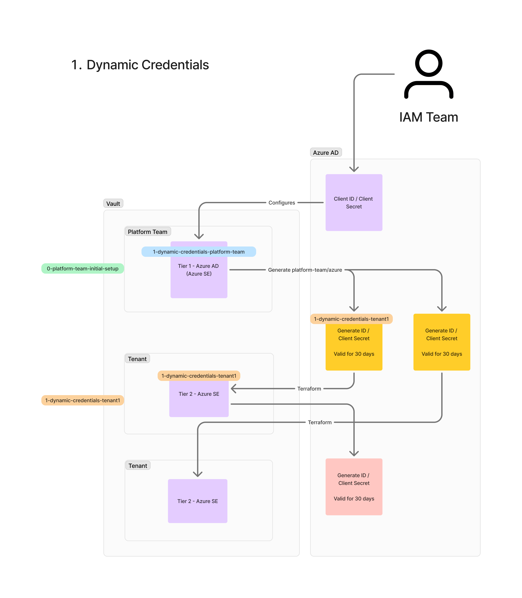

# Vault Azure AD K8s Example

This repository demonstrates how to use HashiCorp Vault Enterprise to enable self-service provisioning of Azure Kubernetes (K8s) resources. For ease we are 



## Prerequisites
* [Vault CLI installed](https://developer.hashicorp.com/vault/docs/install)
* A local Kubernetes (K8s) cluster
* An Azure account
* A Vault Enterprise license

## Starting Vault

For this example, we are using a local Kubernetes cluster with Vault Enterprise deployed via Helm.

### Step 1: Prepare the Vault License

Before deploying Vault, you need to create a Kubernetes secret containing your Vault Enterprise license. Replace `vault.hclic` with the actual path to your license file.

If you prefer, you can copy the `vault.hclic` file into this directory (the `.gitignore` file already includes this to prevent it from being committed).

### Step 2: Deploy Vault

Run the `install-vault.sh` script to set up Vault quickly:

```bash
source install-vault.sh
```

This will install, start, and initialize Vault.

### Step 3: Accessing Vault

To access Vault locally, run the following command to set up port forwarding in the background:

```bash
kubectl -n vault port-forward services/vault 8200:8200 2>&1 >/dev/null & PORT_FORWARD_PID=$!; echo $PORT_FORWARD_PID > pid
```

This will forward port `8200` from the Vault service to your local machine and store the process ID in a file named `pid`. Running the command in the background ensures that your terminal remains free for other tasks.

Alternatively, you can run:

```bash
kubectl -n vault port-forward services/vault 8200:8200
```

However, this will occupy your terminal session until you manually stop the process.

### Stopping the Port Forwarding

If you used the background method, to stop the port forwarding, simply run:

```bash
kill $(cat pid)
```

This will stop the process and free up port `8200` on your local machine.

Initially, you can use Vault's root token, which is output at the end of the script. Alternatively, you can find it in the `init.json` file.

## Cleanup Vault

To remove all Vault components and related Kubernetes resources, run:

```bash
kubectl delete ns vault
```

---

Here's a cleaned-up and enhanced version of your block:

---

# 0. Basic Setup

This initial setup will create the foundational components for the Vault platform team. Note that aside from the namespace creation, everything else is provided as an example of how modules can be structured. For simplicity, we will use the Vault root token in this example.

### Components Created:
- **Vault Platform Team Namespace**: A dedicated namespace for the platform team.
- **Full Control Policy**: A policy granting full control over the platform team namespace.
- **Userpass Authentication**: A simple user-password-based authentication method.
- **JWT Authentication**: JWT-based authentication for integrating external services.

### Pre-requisites:

To ensure this setup functions correctly, the Vault root token must be set as the `TF_VAR_vault_token` environment variable. If you have run the previous Vault setup script with `source` in the same terminal session, this variable should already be set. If not, set it manually by running the following command with your root token:

```bash
export TF_VAR_vault_token="s.xxxxxxx"
```

### Steps to Build the Initial Vault Configuration:

1. Navigate to the setup directory:

```bash
cd 0-platform-team-initial-setup
terraform init
terraform apply
```

After running these steps, the platform team namespace and other components will be created in Vault.

# 1. Dynamic Credentials
This will use Dynamic Credentials from the Parent Namespace Azure Secret Engine to configure Tenant Azure Secret Engine. 

This diagram illustrates the dynamic credential provisioning process for platform and tenant teams using HashiCorp Vault with Azure AD, where Terraform modules (represented by swimlanes) manage the creation of namespaces and secret engines. Vault dynamically generates Azure credentials for each team, automating service principal registration and securely storing client credentials.


**Pros**
* Easy to setup using terraform

**Cons**
* We need to rerun terraform for every tenant once every 30 days to refresh the credentials from the platform-team namespace
* Long lived credentials

**Notes**
* If rotate platform team root then tenant stops working
    * To fix run tf again on `1-dynamic-credentials-tenant1`
    * Then wait for 1 minute to 3 hours (for azure to persisit new service principal, this is not a Vault issue)
    * At first I got `Insufficient privileges to complete the operation.` 
    * In my test I updated with a new ID and Secret at 2:50
    * by 3:20 (30 minutes later) I get `The identity of the calling application could not be established.`
    * by 3:46 (60 minutes later) I get `was not found in the directory 'Default Directory'. This can happen if the application has not been installed by the administrator of the tenant or consented to by any user in the tenant. You may have sent your authentication request to the wrong tenant`
    * For some reason the App registration was deleted hence the above error
    * 

## To Deploy


First, you need to get your Azure Tenant ID, Client ID, Client Secret, and Subscription ID. Follow the instructions in this [guide](./azure-credentials-setup.md) to retrieve these credentials from the Azure Portal.


Next lets deploy our AD secrets engine into our `platform-team` namespace. First lets set the envrioment varibles of the Azure Tenant ID, Client ID, Client Secret, and Subscription ID we got in the previous step.

```bash
export TF_VAR_tenant_id=""
export TF_VAR_client_id=""
export TF_VAR_client_secret=""
export TF_VAR_subscription_id=""
```

Now we can run our terraform to deploy this:

```bash
cd ..
cd 1-dynamic-credentials-platform-team

terraform init
terraform apply
```

If you would like to test this works manualy with your creds use the following"
```bash
export VAULT_NAMESPACE="platform-team"
vault list azure/roles
vault write -f azure/rotate-root 
vault read azure/creds/platform-team
unset VAULT_NAMESPACE
```

## Provision Tenant
Next we can provision a tenenat, run the following. This will only take the `TF_VAR_subscription_id` & `TF_VAR_tenant_id` the `client_id` & `client_secret` will be generated using the platform teams azure secret engine. 

```bash
cd ..
cd 1-dynamic-credentials-tenant1

terraform init
terraform apply
```

If you would like to test this works manualy with your creds use the following, you need to wait 10-15 minutes before running thins:
```bash
export VAULT_NAMESPACE="tenant1"
vault read azure/config
vault list azure/roles
vault write -f azure/rotate-root 
vault read azure/creds/tenant1
unset VAULT_NAMESPACE
```


# 2. Plugin Workload Identity Federation (WIF)
In this section, we will integrate Workload Identity Federation (WIF) to enable secure, token-based authentication between HashiCorp Vault and Azure AD. WIF allows workloads running in Kubernetes or other environments to authenticate with Azure AD without needing long-lived credentials. By using short-lived tokens, this approach enhances security and scalability when accessing Azure resources. We will configure the necessary Vault plugins and demonstrate how Terraform can manage WIF setup, ensuring that your platform and tenant teams can securely access Azure resources without manual credential handling.

**Pros**
* Short lived credentials

**Cons**
* Needs Vault 1.17

**Notes**
* Do we need to update